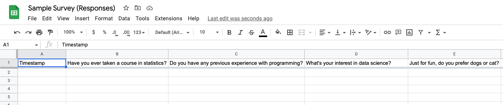

# Google Form Processing
This project shows a streamlined process to transfer Google Form responses from Google Drive to local SQL database.

## Tech Stack Highlights
* Interact with online API services
* Intereact with SQL database using SQLAlchemy
* Perform OOP programming with self-defined modules and classes

## Motivation
Processing survey responses is a common task for data analysts and data scientists. Google Forms is now a very popular online service for its ease to use and powerful integration with Google Sheets.

Automated data transfer to SQL database can help ensure the data can be saved quickly, effortlessly, and more importantly, they will be saved properly without human errors. 

[This dataset](https://www.kaggle.com/datasets/rtatman/5day-data-challenge-signup-survey-responses) in Kaggle is good to show how we can simplify the data transferring process from Google Sheets to SQL database. I have made a [Sample Survey](https://forms.gle/U3bw3URZZmqewRsT9) on Google Forms to demonstrate the process. 

## Workflow
1. Invite people to take the survey.<br>

2. Survey responses will be stored in Google Sheets.<br>

3. Process with ```main.py```.<br>
   * Transfer data from Google Sheets to SQL database.<br>
    
   * Since data is now saved in SQL database, clear data on Google Sheets to avoid inserting the same data next time.
    
## Codes and Database
```main.py```<br>
Performs the streamlined process from Google Sheets data extraction to SQL database.

```gsheet_access.py```<br>
Stores a Sheet class, which can be built with Google API token, spreadsheet name and worksheet name. Users can make a DataFrame from the Google Sheet, count the rows, or even clear the worksheet without writing lines of code.

```sql_process.py```<br>
Contains 2 functions. ```get_dict()```  generates an index dictionary which is useful for transforming data before inserting them into SQL database. Another is ```sheet2sql()```, which transfers data from Google Sheet to SQL database effortlessly.

```survey.sqlite```<br>
<br>
All tables are linked to ```responses``` , in which foreign keys pointing to respective tables are stored. This gives us referential integrity and better performance since we do not need to store a lot of texts in the ```responses``` table even when there are thousands or even millions of records.
